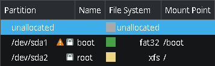

# [X-Arch](http://discord.gg/VzN2WTaGx4)
> [!NOTE]
> Highly optimized Arch for CachyOS.

---

> [!TIP]
> Games:
>> Two Worlds II Velvet Edition = Windows-like experience.\
>> Transformers - The Game = Windows-like experience.\
>> Painkiller - Overdose = Windows-like experience.\
>> Scrapland Remastered = Windows-like experience.\
>> Entropia Universe = Windows-like experience.\
>> Painkiller Black = Windows-like experience.\
>> Where Winds Meet = Windows-like experience.\
>> Cyberpunk 2077 = Windows-like experience.\
>> Screw Drivers = Windows-like experience.\
>> Star Conflict = Windows-like experience.\
>> Blood Strike = Windows-like experience.\
>> Dota 2 Beta = Windows-like experience.\
>> Arx Fatalis = Windows-like experience.\
>> Once Human = Windows-like experience.\
>> War Robots = Windows-like experience.\
>> Cosmoteer = Windows-like experience.\
>> Warframe = Windows-like experience.\
>> Gothic 3 = Windows-like experience.\
>> Enclave = Windows-like experience.

---

> [!IMPORTANT]
> This project is still WIP (Working In Progress) and some bugs or issues could happen.\
> At this moment the project is working flawless on systems with AMD graphics cards and Intel processors.\
> For other graphics cards and processors, needs testers.

---

> [!WARNING]
> Requirements:
>> [KDEP](http://en.wikipedia.org/wiki/KDE_Plasma) as desktop environment,\
>> [SDB](http://en.wikipedia.org/wiki/Systemd-boot) as boot loader,\
>> [UEFI](http://en.wikipedia.org/wiki/UEFI) as firmware interface,\
>> [XFS](http://en.wikipedia.org/wiki/XFS) as file system,\
>> [GPT](http://en.wikipedia.org/wiki/GUID_Partition_Table) as partition table.
>>> 

---

> [!CAUTION]
> Instructions:
>> 1. `sudo pacman --sync --noconfirm --needed dash git`
>> 2. `git clone --branch main --recurse-submodules http://github.com/NemesisElectron/X-Arch.git /tmp/X-Arch`
>> 3. `cd /tmp/X-Arch`
>> 4. `dash ./Setup.sh`

---
